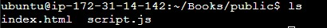
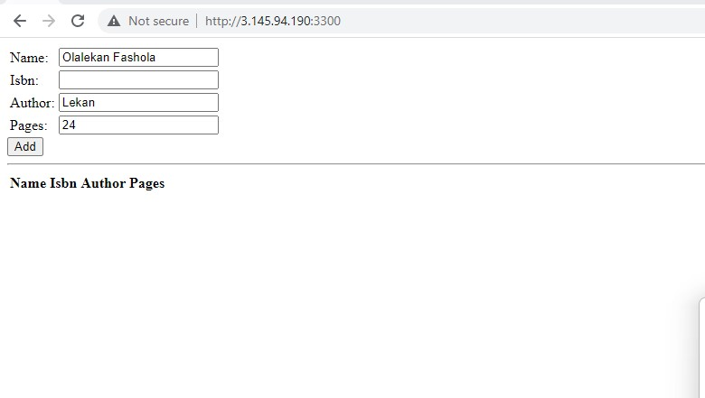

## How To Deploy MEAN Stack To Ubuntu In AWS

Implement a simple Book Register web form using MEAN stack.

## PREREQUISITES ##

**Create a new EC2 Instance of t2.nano family with Ubuntu Server 22.04 LTS (HVM) image**

**Connect to the instance through an SSH client/web**

## Step 1

Download updates for ubuntu

`sudo apt update`

Upgrade ubuntu

`sudo apt upgrade`

Add certificates

`sudo apt -y install curl dirmngr apt-transport-https lsb-release ca-certificates`

`curl -sL https://deb.nodesource.com/setup_18.x | sudo -E bash -`

## Install NodeJS ##

Install NodeJS and NVM

`sudo apt install -y nodejs`

## Step 2

Install MongoDB

MongoDB stores data in flexible, JSON-like documents. Fields in a database can vary from document to document and data structure can be changed over time.

`sudo apt update`

Start The server and verify that the service is up

`sudo systemctl mongod start`
`sudo systemctl mongod status`

Install npm – Node package manager and verify.

`sudo apt install -y npm`
`npm -v`

Install body-parser package

`sudo npm install body-parser`

Create a folder named ‘Books’

`mkdir Books && cd Books`

In the Books directory, Initialize npm project

`npm init`

Add a file to it named server.js

`vi server.js`

Copy and paste the web server code below into the server.js file.

 ## INSTALL EXPRESS AND SET UP ROUTES TO THE SERVER ##

 ## Step 3 ##

 Express is a minimal and flexible Node.js web application framework that provides features for web and mobile applications. We will use Express in to pass book information to and from our MongoDB database.

 `sudo npm install express mongoose`

 

 In ‘Books’ folder, create a folder named apps

 `mkdir apps && cd apps`

  

 Create a file named routes.js

 `vi routes.js`

 

 Copy and paste the code below into routes.js

 

 In the ‘apps’ folder, create a folder named models

 `mkdir models && cd models`

Create a file named book.js

`vi book.js`

Copy and paste the code below into ‘book.js’

## Step 4 – Access the routes with AngularJS ##

AngularJS provides a web framework for creating dynamic views in your web applications. In this tutorial, we use AngularJS to connect our web page with Express and perform actions on our book register.

Change the directory back to ‘Books’

`cd ../..`

Create a folder named public

`mkdir public && cd public`

Add a file named script.js

`vi script.js`

Copy and paste the Code below (controller configuration defined) into the script.js file.

In public folder, create a file named index.html;

`vi index.html`

Copy and paste the code below into index.html file.

Change the directory back up to Books

`cd ..`

Start the server by running this command:

`node server.js`

Find the public ip address

`curl -s http://169.254.169.254/latest/meta-data/public-ipv4`

Browser output

